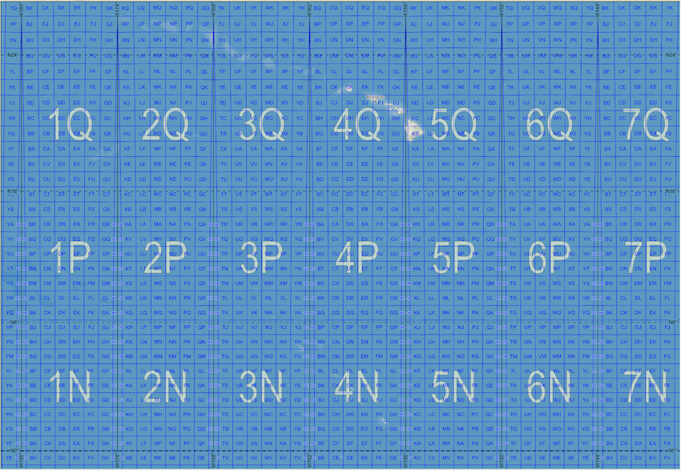

```{r pkg-knitr-opts, include=FALSE}
hrbrpkghelpr::global_opts()
```

```{r badges, results='asis', echo=FALSE, cache=FALSE}
hrbrpkghelpr::stinking_badges()
```

```{r description, results='asis', echo=FALSE, cache=FALSE}
hrbrpkghelpr::yank_title_and_description()
```

Essentially, a lightweight R wrapper around bits of <https://svn.osgeo.org/gdal/trunk/gdal/frmts/nitf/>.

Decent reference on MGRS & UTM (Universal Transverse Mercator): <https://www.luomus.fi/en/utm-mgrs-atlas-florae-europaeae>.

The origin of the MGRS grid, in the Pacific. Honolulu is in 4QFJ.



[CC-BY-SA 3.0](https://en.wikipedia.org/wiki/Military_Grid_Reference_System#/media/File:MGRSgridOriginSchemeAA.png)

## What's Inside The Tin

The following functions are implemented:

```{r ingredients, results='asis', echo=FALSE, cache=FALSE}
hrbrpkghelpr::describe_ingredients()
```

## Installation

```{r install-ex, results='asis', echo=FALSE, cache=FALSE}
hrbrpkghelpr::install_block()
```

## Usage

```{r vers, message=FALSE, warning=FALSE, error=FALSE, cache=FALSE}
library(mgrs)
library(hrbrthemes)
library(tidyverse)

# current version
packageVersion("wand")
```

### Basics

```{r ex1}
mgrs_to_latlng("33UXP04")

latlng_to_mgrs(48.20535, 16.34593)

mgrs_to_latlng("33UXP0500444996")

latlng_to_mgrs(48.24948, 16.41449)

mgrs_to_latlng("24XWT783908")

latlng_to_mgrs(83.62738, -32.66879)

utm_to_mgrs(48, "N", 377299, 1483035)

mgrs_to_utm("48PUV7729883034")

ups_to_mgrs("N", 2426773, 1530125)

mgrs_to_ups("ZGC2677330125")

grefs <- c("4Q", "4QFJ", "4QFJ16", "4QFJ1267", "4QFJ123678",
           "4QFJ12346789", "4QFJ1234567890")
mgrs_precision(grefs)
```

### Better usage in the {tidyverse}

```{r ex2}
data.frame(
  id = 1:50, 
  mgrs = c("16SEB20", "09UXQ25", "12SVC48", "15SWU64", "11SKA54", "13SDC58", 
"18TYM20", "18SWH08", "17RML38", "17SKR77", "09RYR61", "12TTP62", 
"16TBK93", "16TEK73", "15TVG64", "14SNH75", "16SFG94", "15RWP68", 
"19TEL05", "18SUJ54", "19TBG89", "16TFN87", "15TUM73", "16SBB31", 
"15SWC44", "12TXS28", "14TML57", "11SND12", "19TCJ00", "18SWK62", 
"13SDU11", "18TVN87", "17SQV22", "14TMT13", "17TLE65", "14SPE73", 
"10TGP36", "18TTL93", "19TCG20", "17SNT42", "14TMQ40", "16SEE44", 
"14RNV27", "12SVJ72", "18TXQ90", "17SQB46", "11TKN95", "17SNC25", 
"16TBQ64", "13TCH16"),
  stringsAsFactors = FALSE
) -> sample_dta

dplyr::mutate(sample_dta, x = lapply(mgrs, mgrs_to_latlng, include_mgrs_ref = FALSE)) %>% 
  tidyr::unnest(x)
```

### Visual Verification

```{r ex3, fig.retina=2, fig.width=10, fig.height=5}
library(purrr)
library(ggplot2)

# precision == 1

c("16SEB20", "09UXQ25", "12SVC48", "15SWU64", "11SKA54", "13SDC58", 
"18TYM20", "18SWH08", "17RML38", "17SKR77", "09RYR61", "12TTP62", 
"16TBK93", "16TEK73", "15TVG64", "14SNH75", "16SFG94", "15RWP68", 
"19TEL05", "18SUJ54", "19TBG89", "16TFN87", "15TUM73", "16SBB31", 
"15SWC44", "12TXS28", "14TML57", "11SND12", "19TCJ00", "18SWK62", 
"13SDU11", "18TVN87", "17SQV22", "14TMT13", "17TLE65", "14SPE73", 
"10TGP36", "18TTL93", "19TCG20", "17SNT42", "14TMQ40", "16SEE44", 
"14RNV27", "12SVJ72", "18TXQ90", "17SQB46", "11TKN95", "17SNC25", 
"16TBQ64", "13TCH16") -> mgrs_state_centers

mgrs_to_latlng(mgrs_state_centers) %>% 
  ggplot(aes(lng, lat)) +
  geom_point(shape=22, size=2, color="black", fill="white") +
  coord_map("polyconic") +
  theme_ft_rc(grid="XY")
```

## mgrs Metrics

```{r cloc, echo=FALSE}
cloc::cloc_pkg_md()
```

## Code of Conduct

Please note that this project is released with a Contributor Code of Conduct. By participating in this project you agree to abide by its terms.
