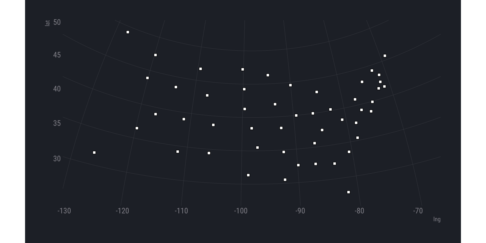

[](http://www.repostatus.org/#active)
[](https://ci.appveyor.com/project/hrbrmstr/mgrs)
[](https://codecov.io/gh/hrbrmstr/mgrs)
[](https://travis-ci.org/hrbrmstr/mgrs)
[](https://gist.github.com/hrbrmstr/be2f2c14fd78cac24697)

# mgrs

Convert ‘MGRS’ (Military Grid Reference System) References From/To Other
Coordinate Systems

## Description

The ‘Military Grid Reference System’ (‘MGRS’) is the geocoordinate
standard used by ‘NATO’ militaries for locating points on the earth. The
‘MGRS’ is derived from the ‘Universal Transverse Mercator’ (‘UTM’) grid
system and the universal polar stereographic (‘UPS’) grid system, but
uses a different labeling convention. The ‘MGRS’ is used for the entire
earth. Methods are provided to convert ‘MGRS’ coordinates to and from
other coordinate systems.

Essentially, a lightweight R wrapper around bits of
<https://svn.osgeo.org/gdal/trunk/gdal/frmts/nitf/>.

Decent reference on MGRS & UTM (Universal Transverse Mercator):
<https://www.luomus.fi/en/utm-mgrs-atlas-florae-europaeae>.

The origin of the MGRS grid, in the Pacific. Honolulu is in 4QFJ.


[CC-BY-SA 3.0](https://en.wikipedia.org/wiki/Military_Grid_Reference_System#/media/File:MGRSgridOriginSchemeAA.png)

## What’s inside the tin?

The following functions are implemented:

  - `latlng_to_mgrs`: Convert latitude/longitude to MGRS string
  - `mgrs_to_latlng`: Convert an MGRS string to latitude/longitude
  - `mgrs_to_ups`: Convert MGRS to UPS
  - `mgrs_to_utm`: Convert MGRS to UTM
  - `ups_to_mgrs`: Convert UPS to MGRS
  - `utm_to_mgrs`: Convert UTM to MGRS
  - `mgrs_precision`: Return MGRS grid reference precision (in meters)

## Installation

``` r
devtools::install_git("https://git.sr.ht/~hrbrmstr/mgrs")
# OR
devtools::install_gitlab("hrbrmstr/mgrs")
# OR 
devtools::install_github("hrbrmstr/mgrs")
```

## Usage

``` r
library(mgrs)
library(hrbrthemes)

# current verison
packageVersion("mgrs")
```

    ## [1] '0.2.0'

``` r
mgrs_to_latlng("33UXP04")
```

    ##      mgrs      lat      lng
    ## 1 33UXP04 48.20535 16.34593

``` r
latlng_to_mgrs(48.20535, 16.34593)
```

    ## [1] "33UXP0000040000"

``` r
mgrs_to_latlng("33UXP0500444996")
```

    ##              mgrs      lat      lng
    ## 1 33UXP0500444996 48.24947 16.41449

``` r
latlng_to_mgrs(48.24948, 16.41449)
```

    ## [1] "33UXP0500344996"

``` r
mgrs_to_latlng("24XWT783908")
```

    ##          mgrs      lat       lng
    ## 1 24XWT783908 83.62738 -32.66879

``` r
latlng_to_mgrs(83.62738, -32.66879)
```

    ## [1] "25XEN0410486507"

``` r
utm_to_mgrs(48, "N", 377299, 1483035)
```

    ## [1] "48PUV7729983035"

``` r
mgrs_to_utm("48PUV7729883034")
```

    ##              mgrs zone hemisphere easting northing
    ## 1 48PUV7729883034   48          N  377298  1483034

``` r
ups_to_mgrs("N", 2426773, 1530125)
```

    ## [1] "ZGC2677330125"

``` r
mgrs_to_ups("ZGC2677330125")
```

    ##            mgrs hemisphere easting northing
    ## 1 ZGC2677330125          N 2426773  1530125

``` r
grefs <- c("4Q", "4QFJ", "4QFJ16", "4QFJ1267", "4QFJ123678",
           "4QFJ12346789", "4QFJ1234567890")
mgrs_precision(grefs)
```

    ## # A tibble: 7 x 2
    ##   grid_ref       precision
    ##   <chr>              <dbl>
    ## 1 4Q                    NA
    ## 2 4QFJ              100000
    ## 3 4QFJ16             10000
    ## 4 4QFJ1267            1000
    ## 5 4QFJ123678           100
    ## 6 4QFJ12346789          10
    ## 7 4QFJ1234567890         1

### Better usage in the tidyverse

``` r
data.frame(
  id = 1:50, 
  mgrs = c("16SEB20", "09UXQ25", "12SVC48", "15SWU64", "11SKA54", "13SDC58", 
"18TYM20", "18SWH08", "17RML38", "17SKR77", "09RYR61", "12TTP62", 
"16TBK93", "16TEK73", "15TVG64", "14SNH75", "16SFG94", "15RWP68", 
"19TEL05", "18SUJ54", "19TBG89", "16TFN87", "15TUM73", "16SBB31", 
"15SWC44", "12TXS28", "14TML57", "11SND12", "19TCJ00", "18SWK62", 
"13SDU11", "18TVN87", "17SQV22", "14TMT13", "17TLE65", "14SPE73", 
"10TGP36", "18TTL93", "19TCG20", "17SNT42", "14TMQ40", "16SEE44", 
"14RNV27", "12SVJ72", "18TXQ90", "17SQB46", "11TKN95", "17SNC25", 
"16TBQ64", "13TCH16"),
  stringsAsFactors = FALSE
) -> sample_dta

dplyr::mutate(sample_dta, x = lapply(mgrs, mgrs_to_latlng, include_mgrs_ref = FALSE)) %>% 
  tidyr::unnest(x)
```

    ##    id    mgrs      lat        lng
    ## 1   1 16SEB20 32.53717  -86.78701
    ## 2   2 09UXQ25 49.19105 -127.35303
    ## 3   3 12SVC48 34.15921 -111.65093
    ## 4   4 15SWU64 34.70027  -92.34486
    ## 5   5 11SKA54 36.47270 -119.79027
    ## 6   6 13SDC58 38.66717 -105.57474
    ## 7   7 18TYM20 41.52143  -72.36334
    ## 8   8 18SWH08 38.66858  -75.00000
    ## 9   9 17RML38 27.84288  -81.71090
    ## 10 10 17SKR77 32.24313  -83.44116
    ## 11 11 09RYR61 31.69589 -126.25687
    ## 12 12 12TTP62 43.49440 -113.96832
    ## 13 13 16TBK93 39.99409  -89.45983
    ## 14 14 16TEK73 40.01730  -86.17974
    ## 15 15 15TVG64 41.91094  -93.48232
    ## 16 16 14SNH75 38.39548  -98.19839
    ## 17 17 16SFG94 37.38730  -84.85379
    ## 18 18 15RWP68 30.55091  -92.37442
    ## 19 19 19TEL05 45.60354  -69.00000
    ## 20 20 18SUJ54 39.19632  -76.73702
    ## 21 21 19TBG89 42.33117  -71.67024
    ## 22 22 16TFN87 43.06136  -84.78947
    ## 23 23 15TUM73 46.31111  -94.68838
    ## 24 24 16SBB31 32.59461  -89.87671
    ## 25 25 15SWC44 38.30721  -92.54249
    ## 26 26 12TXS28 46.76276 -109.42851
    ## 27 27 14TML57 41.27989  -99.59705
    ## 28 28 11SND12 39.02899 -116.88447
    ## 29 29 19TCJ00 43.32625  -71.46678
    ## 30 30 18SWK62 39.92798  -74.29783
    ## 31 31 13SDU11 34.42756 -105.97949
    ## 32 32 18TVN87 43.08245  -75.24570
    ## 33 33 17SQV22 35.39912  -78.57750
    ## 34 34 14TMT13 47.21732 -100.18865
    ## 35 35 17TLE65 40.18872  -82.64462
    ## 36 36 14SPE73 35.49902  -97.12568
    ## 37 37 10TGP36 43.85725 -120.13815
    ## 38 38 18TTL93 40.89416  -77.49288
    ## 39 39 19TCG20 41.53142  -71.15763
    ## 40 40 17SNT42 33.61904  -80.56877
    ## 41 41 14TMQ40 44.25077  -99.75154
    ## 42 42 16SEE44 35.60294  -86.55839
    ## 43 43 14RNV27 31.36434  -98.78970
    ## 44 44 12SVJ72 39.02853 -111.34659
    ## 45 45 18TXQ90 44.22846  -72.62103
    ## 46 46 17SQB46 37.55578  -78.28300
    ## 47 47 11TKN95 47.36969 -119.78156
    ## 48 48 17SNC25 38.39800  -80.77096
    ## 49 49 16TBQ64 44.57333  -90.02272
    ## 50 50 13TCH16 42.96895 -107.32983

### Visual Verification

``` r
library(purrr)
library(ggplot2)

# precision == 1

c("16SEB20", "09UXQ25", "12SVC48", "15SWU64", "11SKA54", "13SDC58", 
"18TYM20", "18SWH08", "17RML38", "17SKR77", "09RYR61", "12TTP62", 
"16TBK93", "16TEK73", "15TVG64", "14SNH75", "16SFG94", "15RWP68", 
"19TEL05", "18SUJ54", "19TBG89", "16TFN87", "15TUM73", "16SBB31", 
"15SWC44", "12TXS28", "14TML57", "11SND12", "19TCJ00", "18SWK62", 
"13SDU11", "18TVN87", "17SQV22", "14TMT13", "17TLE65", "14SPE73", 
"10TGP36", "18TTL93", "19TCG20", "17SNT42", "14TMQ40", "16SEE44", 
"14RNV27", "12SVJ72", "18TXQ90", "17SQB46", "11TKN95", "17SNC25", 
"16TBQ64", "13TCH16") -> mgrs_state_centers

mgrs_to_latlng(mgrs_state_centers) %>% 
  ggplot(aes(lng, lat)) +
  geom_point(shape=22, size=2, color="black", fill="white") +
  coord_map("polyconic") +
  theme_ft_rc(grid="XY")
```



## Code of Conduct

Please note that this project is released with a [Contributor Code of
Conduct](CONDUCT.md). By participating in this project you agree to
abide by its terms.
