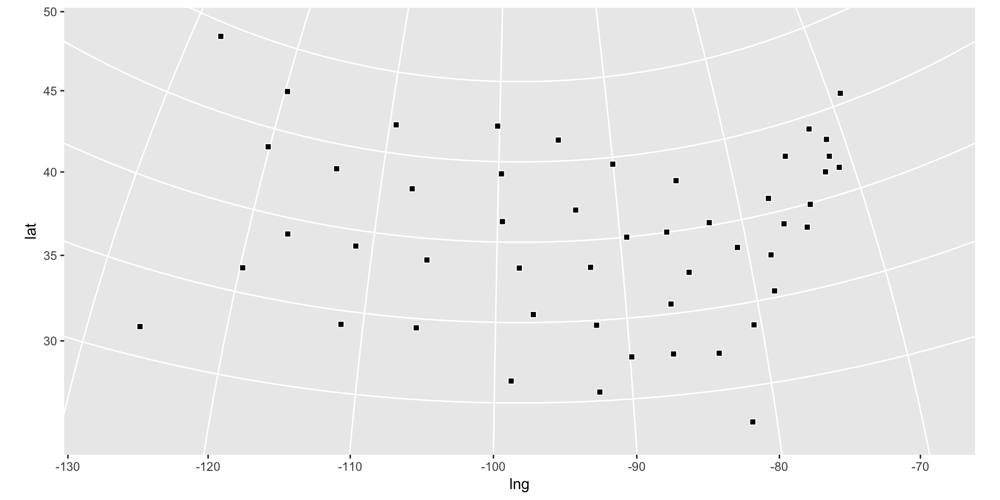

[](http://www.repostatus.org/#active) [](https://codecov.io/gh/hrbrmstr/mgrs) [](https://travis-ci.org/hrbrmstr/mgrs) [](https://gist.github.com/hrbrmstr/be2f2c14fd78cac24697)

`mgrs` : Convert 'MGRS' (Military Grid Reference System) References To and From Other Coordinate Systems

Essentially, a lightweight R wrapper around bits of <https://svn.osgeo.org/gdal/trunk/gdal/frmts/nitf/>.

Decent reference on MGRS & UTM (Universal Transverse Mercator): <https://www.luomus.fi/en/utm-mgrs-atlas-florae-europaeae>.

The following functions are implemented:

-   `latlng_to_mgrs`: Convert latitude/longitude to MGRS string
-   `mgrs_to_latlng`: Convert an MGRS string to latitude/longitude **(now returns a `data.frame`)**
-   `mgrs_to_ups`: Convert MGRS to UPS
-   `mgrs_to_utm`: Convert MGRS to UTM
-   `ups_to_mgrs`: Convert UPS to MGRS
-   `utm_to_mgrs`: Convert UTM to MGRS

### TODO

-   Find all the folks/projects I need to add in the `DESCRIPTION` for auth/ctb & docs
-   Vectorize ALL THE THINGS
-   <strike>Add in support for the other MGRS conversion thingys</strike>
-   More error checking (basic checking is done)
-   Precision validation
-   More tests (basic testing is done)

### Installation

``` r
devtools::install_github("hrbrmstr/mgrs")
```

### Usage

``` r
library(mgrs)

# current verison
packageVersion("mgrs")
```

    ## [1] '0.1.0'

``` r
mgrs_to_latlng("33UXP04")
```

    ##      mgrs      lat      lng
    ## 1 33UXP04 48.20535 16.34593

``` r
latlng_to_mgrs(48.20535, 16.34593)
```

    ## [1] "33UXP0000040000"

``` r
mgrs_to_latlng("33UXP0500444996")
```

    ##              mgrs      lat      lng
    ## 1 33UXP0500444996 48.24947 16.41449

``` r
latlng_to_mgrs(48.24948, 16.41449)
```

    ## [1] "33UXP0500344996"

``` r
mgrs_to_latlng("24XWT783908")
```

    ##          mgrs      lat       lng
    ## 1 24XWT783908 83.62738 -32.66879

``` r
latlng_to_mgrs(83.62738, -32.66879)
```

    ## [1] "25XEN0410486507"

``` r
utm_to_mgrs(48, "N", 377299, 1483035)
```

    ## [1] "48PUV7729983035"

``` r
mgrs_to_utm("48PUV7729883034")
```

    ##              mgrs zone hemisphere easting northing
    ## 1 48PUV7729883034   48          N  377298  1483034

``` r
ups_to_mgrs("N", 2426773, 1530125)
```

    ## [1] "ZGC2677330125"

``` r
mgrs_to_ups("ZGC2677330125")
```

    ##            mgrs hemisphere easting northing
    ## 1 ZGC2677330125          N 2426773  1530125

### Visual Verification

``` r
library(purrr)
library(ggplot2)

# precision == 1

c("16SEB20", "09UXQ25", "12SVC48", "15SWU64", "11SKA54", "13SDC58", 
"18TYM20", "18SWH08", "17RML38", "17SKR77", "09RYR61", "12TTP62", 
"16TBK93", "16TEK73", "15TVG64", "14SNH75", "16SFG94", "15RWP68", 
"19TEL05", "18SUJ54", "19TBG89", "16TFN87", "15TUM73", "16SBB31", 
"15SWC44", "12TXS28", "14TML57", "11SND12", "19TCJ00", "18SWK62", 
"13SDU11", "18TVN87", "17SQV22", "14TMT13", "17TLE65", "14SPE73", 
"10TGP36", "18TTL93", "19TCG20", "17SNT42", "14TMQ40", "16SEE44", 
"14RNV27", "12SVJ72", "18TXQ90", "17SQB46", "11TKN95", "17SNC25", 
"16TBQ64", "13TCH16") -> mgrs_state_centers

mgrs_to_latlng(mgrs_state_centers) %>% 
  ggplot(aes(lng, lat)) +
  geom_point(shape=22, size=2, color="white", fill="black") +
  coord_map("polyconic")
```



### Test Results

``` r
library(mgrs)
library(testthat)
```

    ## 
    ## Attaching package: 'testthat'

    ## The following object is masked from 'package:purrr':
    ## 
    ##     is_null

``` r
date()
```

    ## [1] "Mon Apr 10 13:28:40 2017"

``` r
test_dir("tests/")
```

    ## testthat results ========================================================================================================
    ## OK: 10 SKIPPED: 0 FAILED: 0
    ## 
    ## DONE ===================================================================================================================

### Code of Conduct

Please note that this project is released with a [Contributor Code of Conduct](CONDUCT.md). By participating in this project you agree to abide by its terms.
