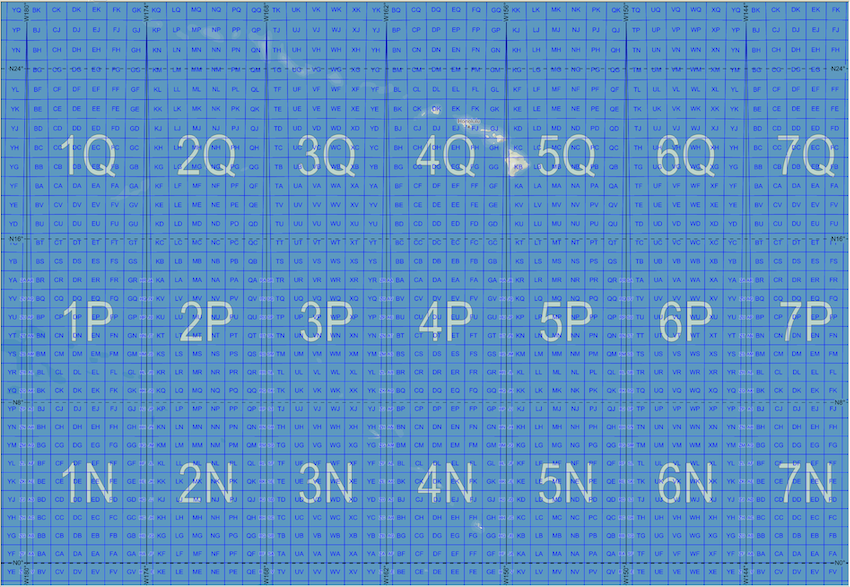
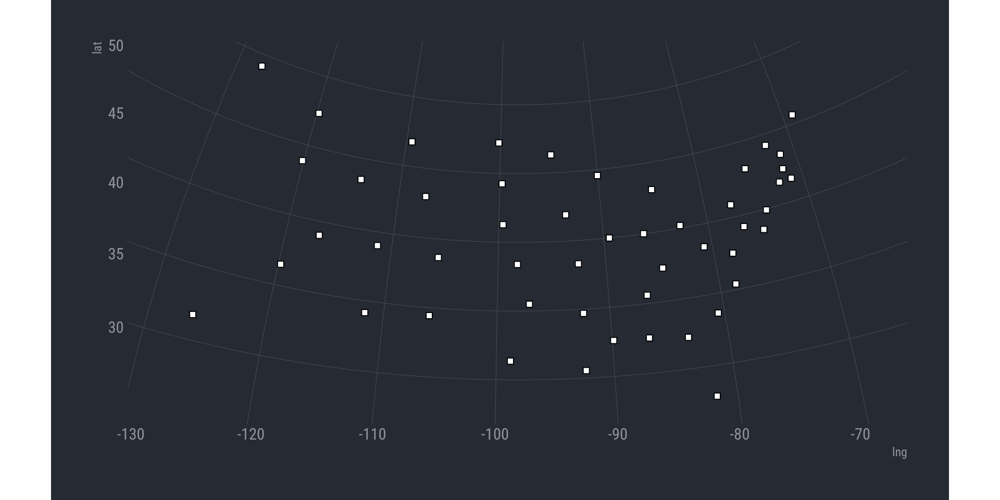

[](https://www.repostatus.org/#active)
[](https://keybase.io/hrbrmstr)


# mgrs

Convert ‘MGRS’ (‘Military Grid Reference System’) Coordinates From/To
Other Coordinate Systems

## Description

The ‘Military Grid Reference System’ (‘MGRS’) is the geocoordinate
standard used by ‘NATO’ militaries for locating points on the earth. The
‘MGRS’ is derived from the ‘Universal Transverse Mercator’ (‘UTM’) grid
system and the universal polar stereographic (‘UPS’) grid system, but
uses a different labeling convention. The ‘MGRS’ is used for the entire
earth. Methods are provided to convert ‘MGRS’ coordinates to and from
other coordinate systems.

Essentially, a lightweight R wrapper around bits of
<https://svn.osgeo.org/gdal/trunk/gdal/frmts/nitf/>.

Decent reference on MGRS & UTM (Universal Transverse Mercator):
<https://www.luomus.fi/en/utm-mgrs-atlas-florae-europaeae>.

The origin of the MGRS grid, in the Pacific. Honolulu is in 4QFJ.

<figure>

<figcaption aria-hidden="true">The origin of the MGRS grid, in the
Pacific. Honolulu is in 4QFJ.</figcaption>
</figure>

[CC-BY-SA
3.0](https://en.wikipedia.org/wiki/Military_Grid_Reference_System#/media/File:MGRSgridOriginSchemeAA.png)

## What’s Inside The Tin

The following functions are implemented:

- `latlng_to_mgrs`: Convert latitude/longitude to MGRS string
- `mgrs_precision`: Return MGRS grid reference precision (in meters)
- `mgrs_to_latlng`: Convert an MGRS string to latitude/longitude
- `mgrs_to_ups`: Convert MGRS to UPS
- `mgrs_to_utm`: Convert MGRS to UTM
- `ups_to_latlng`: Convert UPS to Latitude/Longitude
- `ups_to_mgrs`: Convert UPS to MGRS
- `utm_to_latlng`: Convert UTM to Latitude/Longitude
- `utm_to_mgrs`: Convert UTM to MGRS

## Installation

``` r
remotes::install_github("hrbrmstr/mgrs")
```

NOTE: To use the ‘remotes’ install options you will need to have the
[{remotes} package](https://github.com/r-lib/remotes) installed.

## Usage

``` r
library(mgrs)
library(hrbrthemes)

# current version
packageVersion("mgrs")
## [1] '0.2.4'
```

### Basics

``` r
mgrs_to_latlng("33UXP04")
##      mgrs      lat      lng
## 1 33UXP04 48.20535 16.34593

latlng_to_mgrs(48.20535, 16.34593)
## [1] "33UXP0000040000"

mgrs_to_latlng("33UXP0500444996")
##              mgrs      lat      lng
## 1 33UXP0500444996 48.24947 16.41449

latlng_to_mgrs(48.24948, 16.41449)
## [1] "33UXP0500344996"

mgrs_to_latlng("24XWT783908")
##          mgrs      lat       lng
## 1 24XWT783908 83.62738 -32.66879

latlng_to_mgrs(83.62738, -32.66879)
## [1] "25XEN0410486507"

utm_to_mgrs(48, "N", 377299, 1483035)
## [1] "48PUV7729983035"

mgrs_to_utm("48PUV7729883034")
##              mgrs zone hemisphere easting northing
## 1 48PUV7729883034   48          N  377298  1483034

ups_to_mgrs("N", 2426773, 1530125)
## [1] "ZGC2677330125"

mgrs_to_ups("ZGC2677330125")
##            mgrs hemisphere easting northing
## 1 ZGC2677330125          N 2426773  1530125

c(
  "4Q", "4QFJ", "4QFJ16", 
  "4QFJ1267", "4QFJ123678",
  "4QFJ12346789", "4QFJ1234567890"
) -> grefs

mgrs_precision(grefs)
## # A tibble: 7 × 2
##   grid_ref       precision
##   <chr>              <dbl>
## 1 4Q                    NA
## 2 4QFJ              100000
## 3 4QFJ16             10000
## 4 4QFJ1267            1000
## 5 4QFJ123678           100
## 6 4QFJ12346789          10
## 7 4QFJ1234567890         1
```

### Usage in the {tidyverse}

``` r
data.frame(
  id = 1:50, 
  mgrs = c(
    "16SEB20", "09UXQ25", "12SVC48", "15SWU64", "11SKA54", "13SDC58", 
    "18TYM20", "18SWH08", "17RML38", "17SKR77", "09RYR61", "12TTP62", 
    "16TBK93", "16TEK73", "15TVG64", "14SNH75", "16SFG94", "15RWP68", 
    "19TEL05", "18SUJ54", "19TBG89", "16TFN87", "15TUM73", "16SBB31", 
    "15SWC44", "12TXS28", "14TML57", "11SND12", "19TCJ00", "18SWK62", 
    "13SDU11", "18TVN87", "17SQV22", "14TMT13", "17TLE65", "14SPE73", 
    "10TGP36", "18TTL93", "19TCG20", "17SNT42", "14TMQ40", "16SEE44", 
    "14RNV27", "12SVJ72", "18TXQ90", "17SQB46", "11TKN95", "17SNC25", 
    "16TBQ64", "13TCH16"
    )
) -> sample_dta

sample_dta |> 
  dplyr::mutate(
    x = lapply(mgrs, mgrs_to_latlng, include_mgrs_ref = FALSE)
  ) |>
  tidyr::unnest(x) |> 
  sf::st_as_sf(
    coords = c("lng", "lat"),
    crs = 4326
  )
## Simple feature collection with 50 features and 2 fields
## Geometry type: POINT
## Dimension:     XY
## Bounding box:  xmin: -127.353 ymin: 27.84288 xmax: -69 ymax: 49.19105
## Geodetic CRS:  WGS 84
## # A tibble: 50 × 3
##       id mgrs                geometry
##  * <int> <chr>            <POINT [°]>
##  1     1 16SEB20 (-86.78701 32.53717)
##  2     2 09UXQ25  (-127.353 49.19105)
##  3     3 12SVC48 (-111.6509 34.15921)
##  4     4 15SWU64 (-92.34486 34.70027)
##  5     5 11SKA54  (-119.7903 36.4727)
##  6     6 13SDC58 (-105.5747 38.66717)
##  7     7 18TYM20 (-72.36334 41.52143)
##  8     8 18SWH08       (-75 38.66858)
##  9     9 17RML38  (-81.7109 27.84288)
## 10    10 17SKR77 (-83.44116 32.24313)
## # ℹ 40 more rows
```

### Visual Verification

``` r
library(ggplot2)
library(sf)

# precision == 1

c(
  "16SEB20", "09UXQ25", "12SVC48", "15SWU64", "11SKA54", "13SDC58", 
  "18TYM20", "18SWH08", "17RML38", "17SKR77", "09RYR61", "12TTP62", 
  "16TBK93", "16TEK73", "15TVG64", "14SNH75", "16SFG94", "15RWP68", 
  "19TEL05", "18SUJ54", "19TBG89", "16TFN87", "15TUM73", "16SBB31", 
  "15SWC44", "12TXS28", "14TML57", "11SND12", "19TCJ00", "18SWK62", 
  "13SDU11", "18TVN87", "17SQV22", "14TMT13", "17TLE65", "14SPE73", 
  "10TGP36", "18TTL93", "19TCG20", "17SNT42", "14TMQ40", "16SEE44", 
  "14RNV27", "12SVJ72", "18TXQ90", "17SQB46", "11TKN95", "17SNC25", 
  "16TBQ64", "13TCH16"
) -> mgrs_conus_state_centers

mgrs_conus_state_centers |> 
  mgrs_to_latlng() |>
  st_as_sf(
    coords = c("lng", "lat"),
    crs = 4326
  ) |> 
  ggplot() +
  geom_sf(
    shape = 22,
    ize = 2, color = "black", 
    fill = "white"
  ) +
  coord_sf(
    crs = 5070
  ) +
  theme_ft_rc(grid="XY")
```



## mgrs Metrics

| Lang         | \# Files |  (%) |  LoC |  (%) | Blank lines |  (%) | \# Lines |  (%) |
|:-------------|---------:|-----:|-----:|-----:|------------:|-----:|---------:|-----:|
| C            |        5 | 0.16 | 1847 | 0.38 |         334 | 0.34 |      918 | 0.27 |
| C++          |        2 | 0.06 |  346 | 0.07 |          64 | 0.07 |       99 | 0.03 |
| C/C++ Header |        5 | 0.16 |  188 | 0.04 |          74 | 0.08 |      546 | 0.16 |
| R            |        4 | 0.12 |   41 | 0.01 |          17 | 0.02 |      148 | 0.04 |
| SUM          |       16 | 0.50 | 2422 | 0.50 |         489 | 0.50 |     1711 | 0.50 |

{cloc} 📦 metrics for mgrs

## Code of Conduct

Please note that this project is released with a Contributor Code of
Conduct. By participating in this project you agree to abide by its
terms.
